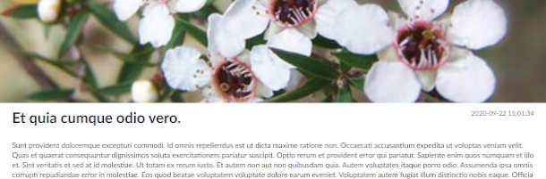
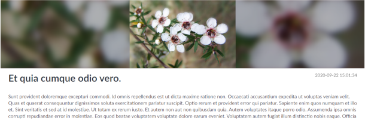

### Creating Articles

To create a Article press the **Create Article** button located on the Article Resource page.

An Article requires :

- **Title**
- **Body** ([see here for info on Trix Fields](trix 'Trix Field'))
- **Publish date**
- **Image**

### Thumbnail/Featured image

The image you upload will be used as the thumbnail on the article card. You can choose whether to display it on the page of the article by ticking the **Include Featured Image** box. if you have included the featured image, you can also choose how you want the image to be displayed with the **Blur featured image background** check box, this respects the images aspect ratio sizing and creates a blurred background to fill space. The images below show the difference.

 :x: No blurred background

 :heavy_check_mark: Blurred background
