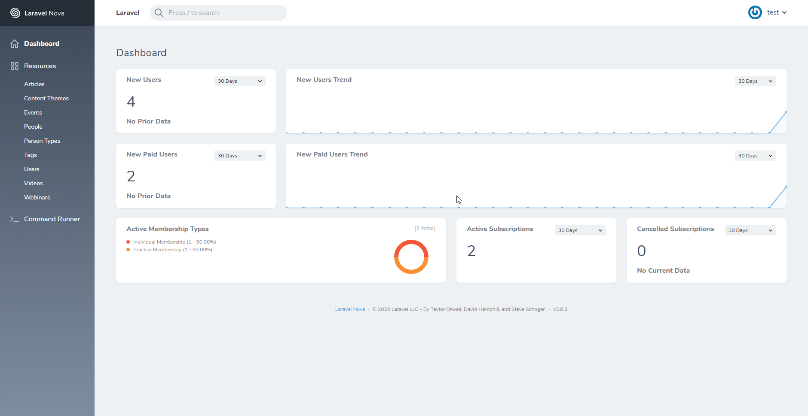
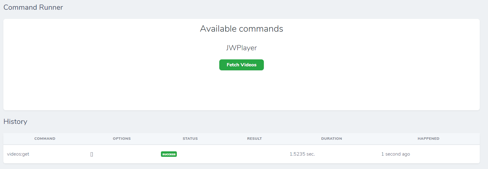

This documentation will explain everything you need to know to manage and add content to **The Vet Wound Library** site using the **Laravel Nova** admin panel.

## The Dashboard

The dashboard is the first page you will come to when logging into Nova, it serves as the homepage of the admin panel. Here you can view various metrics of the site.

On the left is the navigation for the admin panel.

### Resources

Resources refer to each type of content you can manage within the admin panel.

- [Articles](articles.md 'Articles Resource')
- [Content Themes](content-themes.md 'Content Theme Resource')
- [Events](events.md 'Events Resource')
- [People](people.md 'People Resource')
- [Person Types](person-types.md 'Person Type Resource')
- [Tags](tags.md 'Tags Resource')
- [Users](users.md 'Users Resource')
- [Videos](videos.md 'Videos Resource')
- [Webinars](webinars.md 'Webinars Resource')

### Command Runner

The Command Runner is where you can run certain commands related to the site. Currently the only command needed is the Fetch Videos command.

#### Fetch Videos

The fetch videos command is used whenever new videos in **JW Player** need to be fetched, the command will populate the [videos resource](/videos 'Videos Resource') with all videos uploaded in **JW Player**.
