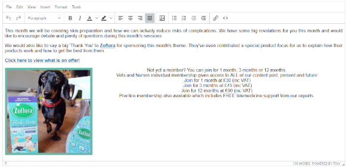
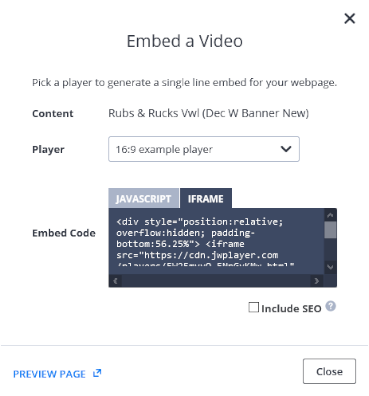
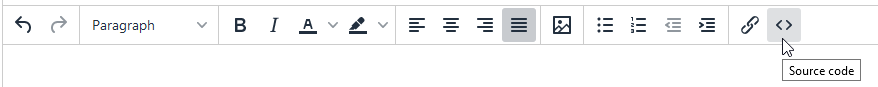
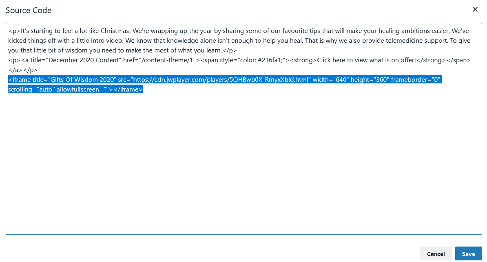

A **TinyMCE** field is simply an advanced text editor field that allows you to do some basic formatting, styling and insert images.

### Adding Videos

Sometimes you may want to embed a video into the body text of something, this is possible however, currently it is a little fiddly to achieve.

1. Find the video you would like to embed on JWPlayer.

2. Press the Embed button.

3. You will be presented with a popup window similar to this 

4. Select a "Player" from the drop down, this will detemine the size of player.

5. Make sure you have "IFrame" selected and copy all the text from the text box.

6. Go back to the resource you are creating in nova and select the "Source Code" option in the tinyMCE toolbar 

7. Paste the text you copied from JWPlayer onto the bottom of the code in the source code text box and hit save.

 
